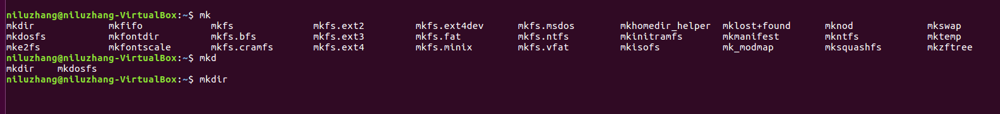
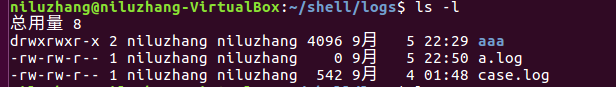
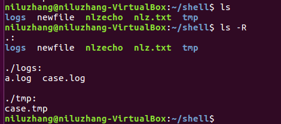
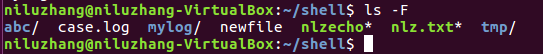
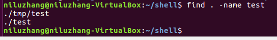
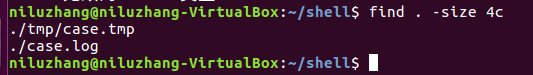

# Linux Notebook
>天下大事，必作于细。
>--《道德经》
>
本文中的所有实验都是基于`ubuntu-16.04.1`。
## 图形界面使用
+ 打开终端快捷键: `ctrl + alt + T`。多次使用该快捷键将打开多个终端。  
  关闭终端: `ctrl + D`快捷键，或者直接点击终端界面的关闭按钮。
+ 显示隐藏文件/取消显示隐藏文件: `ctrl + H`。
## Shell命令
+ Shell命令的基本格式:  
    ````
    命令名 [选项]... [参数]...
    ````
    命令严格区分大小写。通过分号;可以分隔多条命令，从而在一行中输入多个命令。
+ 命令自动补齐:  
Tab键可以联想命令，如果只有唯一联想结果，那么就会自动在命令行补齐命令。如下图:  

如图，直接在命令行输入mk，然后按两下Tab，则会联想出mk开头的所有命令，有很多；继续输入d，再按两下Tab，联想出了mkdir和mkdosfs；继续输入i，再按两下Tab，则mkdir命令被自动补全。
+ Shell提示符:  
格式为: `[登录用户@主机名~]提示符`。  
其中，root用户登录成功，提示符为#号；普通用户登录成功，提示符为$；如果当前是用户主目录，则路径部分显示为~。
+ 查看命令帮助:  
可以用man命令或者--help选项或者info命令。  
例如想查看adduser命令的用法，你可以:
    ````
    man adduser    这个很全，而且有例子
    adduser --help    这个告诉你一些常用的参数
    info adduser
    ````
    此外也可以使用help命令查看Linux内部命令的帮助信息，如查看source:
    ````
    help source    查看source命令的帮助信息
    ````
+ 内部命令和外部命令:  
  + 内部命令: 内部命令是内嵌在Shell程序里的，其包含的往往是一些简单的Linux系统命令。它们被Shell程序识别并通过Shell内部完成运行，通常在Linux系统加载运行时Shell就被加载并驻留在系统内存中。内部命令的执行速度通常都比外部命令快。  
常见的内部命令: alias, bg, bind, break, builtin, caller, cd, command, compgen, complete, compopt,  continue,  declare,  dirs,  disown,  echo,enable,  eval,  exec, exit, export, false, fc, fg, getopts, hash, help,history, jobs, kill, let, local, logout, mapfile, popd, printf,  pushd,pwd,  read, readonly, return, set, shift, shopt, source, suspend, test,times, trap, true, type, typeset, ulimit, umask, unalias, unset, wait。  
   + 外部命令: Linux系统中能够完成特定功能的脚本文件或二进制文件，每个外部命令对应了系统中的一个文件。这些文件通常比较强大，包含的程序量也很大，在系统加载时并不随系统一起被加载到内存中，而是在需要时才将其调用内存。外部命令的实体通常并不包含在Shell中，但是其命令执行过程是由Shell程序控制的。Shell程序管理外部命令执行的路径查找、加载存放，并控制命令的执行。  
   + 可以通过type查看命令是内部命令还是外部命令，如:
        ````
        type cd    输出: cd是shell内建
        ````
+ Linux重启/关机:
  + 重启
    ````
    reboot  立即重启
    shutdown -r now 立即重启
    shutdown -r 10  过10分钟自动重启
    shutdown -r 20:35  在时间20:35的时候重启
    ````
    如果是通过shutdown命令设置重启的话，可以用shutdown -c命令取消重启。  
  + 关机:
    ````
    halt     立即关机
    poweroff   立即关机
    shutdown -h now  立刻关机
    shutdown -h 10    10分钟后自动关机
    ````
    如果是通过shutdown命令设置关机的话，可以用shutdown -c命令取消关机。
+ 查找命令位置:  
通过which命令查看:    
which命令按文件名查找。which会在用户设置的PATH目录中查询，所以也可以查询系统命令。如:
    ````
    which pwd，输出/bin/pwd。
    ````
    也可以一次性输出多个命令的位置，如:
    ````
    which pwd echo nlzecho。
    ````
    whereis，按文件名查找，会列出所有位置。如:
    ````
    whereis nlz，输出: /home/niluzhang/shell/nlz.txt。
    ````
+ 隐藏文件:  
建立文件或者文件夹时，如果以.开头，那么得到的就是隐藏文件。  
通过命令将文件a隐藏: `mv a .a`。  
显示所有文件，包括隐藏文件: `ls -a`。
+ 工作目录、用户主目录、绝对路径、相对路径等概念:  
工作目录是用户当前所处的目录，可以用pwd查看工作目录的绝对路径；  
主目录是创建用户时给这个用户指定的目录，用符号~表示；  
绝对路径是从根开始到某个文件或目录的路径；  
相对路径是从用户工作目录开始到某个文件或目录的路径。
+ cat命令:  
cat命令将文件连接，然后输出到标准输出。  
一次显示整个文件到命令行:
    ````
    cat case.log
    ````
    从键盘创建文件:
    ````
    cat > newfile
    ````
    注意这个命令只能创建新文件，不能编辑已有的文件。按两次`ctrl + D`退出输入，终端重新出现Shell提示符。  
    将几个文件合并到一个文件:  
    ````
    cat file1 file2 > file3
    ````
    此外，cat命令可以通过-n或者--number选项在输出文件的时候显示行号；-b或者--number-nonblank，也是从1开始对输出行编号，但是不对空白行编号；-s或–-squeeze-blank，当遇到有连续两行以上的空白行，就代换为一行的空白行。
+ more命令:  
more命令显示文件内容，每次显示一屏。
如查看一个比较大的日志文件case.log，可以使用命令:
    ````
    more case.log
    ````
    此时终端会输出一屏的日志信息:
    
    此时按Enter键可以向下翻滚一行；按空格键可以向下滚动一屏；按H键获取帮助；按Q退出more查看。  
    一些常用选项:
    ````  
    more +<num> file     从指定行开始显示
    more -s file    将多个空行压缩成一个空行显示
    ````
+ less命令:  
按页显示文件内容。与more不同的是，less支持往上翻和往下翻，more只能往下翻。用less命令显示文件时，用PageUp键向上翻页，用PageDown键向下翻页。要退出less程序，应按Q键。
+ cp命令:  
cp命令将源文件或者目录复制到目标文件或者目录中。  
文件a复制到文件b:
    ````
    cp a b
    ````
    所有.log文件复制到logs目录下:
    ````
    cp *.log logs    注意这里如果logs目录不存在会报错
    ````
    一些常用选项:
    ````
    cp -r logs logs2    递归复制目录下的文件和子目录
    cp -a logs logs2    等同于cp -dpR logs logs2，递归复制，保留文件或目录的属性，当复制符号连接时，把目标文件或目录也建立为符号连接，并指向与源文件或目录连接的原始文件或目录
    ````
+ rm命令:  
rm命令用于删除给定的文件或目录。
常用操作:
    ````
    rm case2.log    删除文件case2.log
    rm -d logs2   删除空目录logs2，如果logs2非空，则会报错
    rm -f unexist   强制删除文件unexist，即使该文件不存在也不报错
    rm -rf logs2   递归删除该目录下的子文件和子目录
    rm *.tmp   删除所有.tmp文件
    ````
+ mv命令:  
mv用来对文件或者目录重命名。  
移动所有的.log文件到logs目录下:
    ````
    mv *.log logs
    ````
+ mkdir命令:  
mkdir命令用于创建目录。  
创建临时目录tmp:
    ````
    mkdir tmp
    ````
    如果是多级目录且上级目录没有创建，则可以使用-p选项:
    ````
    mkdir -p res/tmp
    ````
    不加-p则会报错。
+ rmdir命令:  
rmdir命令用来删除空目录。
删除空的临时目录tmp:
    ````
    rmdir tmp
    ````
    -p选项: 如果删除空目录后，这个空目录的上级目录变成了空目录，则将其一并删除。
+ ls命令:  
ls命令显示目录的内容。  
-l选项显示文件或目录的详细信息。包括文件类型、权限、硬链接数、所有者名、组名、大小(bytes)、时间信息。如下图:

-a选项列出所有文件，包括以.开头的隐藏文件。  
-A选项，--almost-all选项列出除.和..外的所有文件。  
-R选项递归列出遇到的子目录。
。  
列出符合某个模式的文件或目录:  
    ````
    ls *.log
    ````
    -F，--classify，--file-type选项在每个文件名后附上一个字符以说明该文件的类型。"*"表示普通的可执行文件；"/"表示目录；"@"表示符号链接；"|"表示FIFOs；"="表示套接字 (sockets) ；什么也没有则表示普通文件。如图所示:
    
+ find命令
find命令在指定目录下查找文件。  
在当前目录及子目录下查找名为test的目录或者文件。
    ````
    find . -name test
    ````
    输出:
    
    -type选项后接文件类型，表示只输出指定类型的文件。文件类型可以有: f 普通文件; l 符号链接; d 目录; c 字符设备; b 块设备; s 套接字; p Fifo。
    ````
    find . -type f
    ````
    -size选项后接大小表示查找符合特定大小条件的文件。 大小一般是数字值加单位，b表示块(512字节)，c表示字节，w表示字(2字节)，k表示千字节，M表示兆字节，G表示吉字节。大小前面加+号，表示查找大于这个大小的文件，不加符号表示查找等于这个大小的文件，加-号表示查找小于这个大小的文件。
    
    