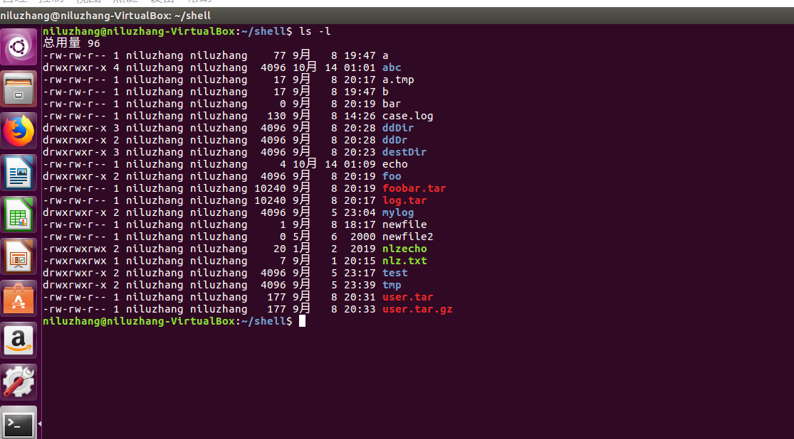
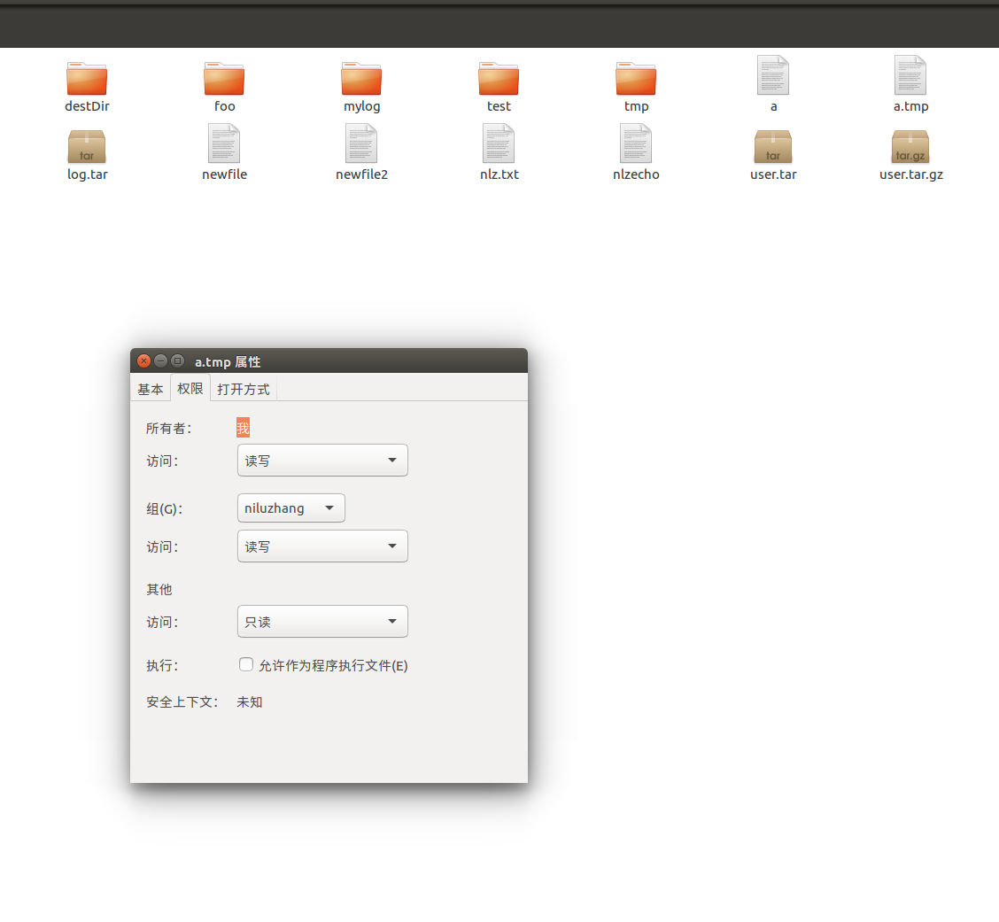

# 文件基本属性
Linux系统是一种典型的多用户系统，不同的用户处于不同的地位，拥有不同的权限。为了保护系统的安全性，Linux系统对不同的用户访问同一文件（包括目录文件）的权限做了不同的规定。  
在Linux中我们可以使用ll或者ls –l命令来显示一个文件的属性以及文件所属的用户和组，如:  
  
可以看到，每个文件/目录的详细信息的第一个字符是-或者d，在Linux中，这个字符代表这个文件是目录、文件或链接文件等等。总共有以下几种:  
+ 当为`d`则是目录
+ 当为`-`则是文件；
+ 若是`l`则表示为链接文档(link file)；
+ 若是`b`则表示为装置文件里面的可供储存的接口设备(可随机存取装置)；
+ 若是`c`则表示为装置文件里面的串行端口设备，例如键盘、鼠标(一次性读取装置)。  

接下来的字符中，以三个为一组，且均为`rwx`的三个参数的组合。其中，`r`代表可读(read)、`w`代表可写(write)、`x`代表可执行(execute)。要注意的是，这三个权限的位置不会改变，如果没有权限，就会出现减号`-`而已。分别表示文件所有者(属主)、文件所有者的同组用户(属组)、其他用户对该文件的权限。
## 文件的属主和属组
对于文件来说，它都有一个特定的所有者，也就是对该文件具有所有权的用户。  
同时，在Linux系统中，用户是按组分类的，一个用户属于一个或多个组。  
文件所有者以外的用户又可以分为文件所有者的同组用户和其他用户。  
因此，Linux系统按文件所有者、文件所有者同组用户和其他用户来规定了不同的文件访问权限。  
在上面的图中，a.tmp文件的属主对其有读写权限，a.tmp的属主同组的其他用户对其有读写权限，其他用户有读权限。我们可以在Linux的GUI界面上印证这一点: 右键a.tmp->属性->权限，可以看到如下:  
  
对于root用户来说，一般情况下，文件的权限对其不起作用。
### 更改文件属性
#### chgrp更改文件属组
语法:
````
chgrp [-R] <属组名> <文件名>
````
其中，-R参数：递归更改文件属组，就是在更改某个目录文件的属组时，如果加上-R的参数，那么该目录下的所有文件的属组都会更改。
#### chown更改文件属主，也可同时更改属组
语法:
````
chown [–R] <属主名> <文件名>
chown [-R] <属主名:属组名> <文件名>
````
#### chmod更改文件的9个属性
chmod支持通过数字或者符号来设置文件权限。
通过数字设置文件权限的语法:
````
chmod [-R] xyz <文件名>
````
通过符号设置文件权限的语法:  
通过u、g、o分别表示属主、属组和其他用户，a表示所有身份:
````
chmod [-R] <身份的组合><+、-、=的组合><r、w、x的组合> <文件名>
````
其中，+表示增加这个权限，-表示去除这个权限，=表示设置为这个权限。
例如:
````
chmod ug=rw a.tmp
或者
chmod u=rw,g=rw a.tmp
````