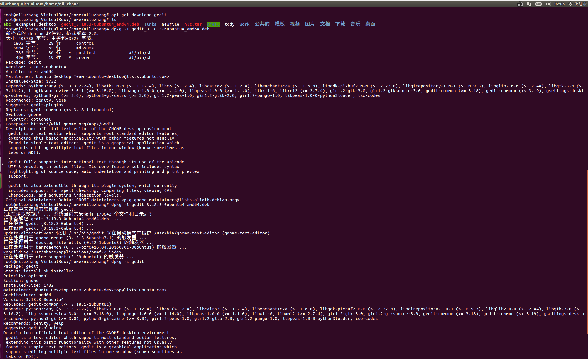
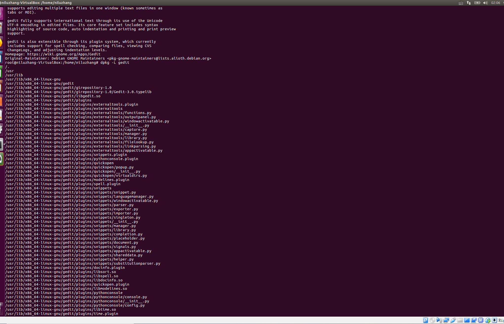
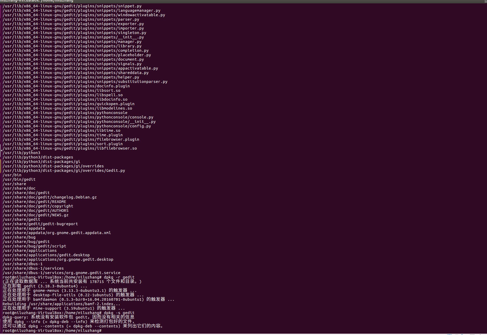

# Linux下的软件安装
Linux下安装软件有多种方式:
+ 使用包管理器安装(如dpkg、APT、rpm、yum等)；
+ 从源码安装；
+ 从.bin文件安装。

下面分别介绍。
## 包管理器安装
在Linux中，包管理器非常重要，了解如何使用多种包管理器可以让你像一个高手一样活得很舒适，从在仓库下载软件、安装软件，到更新软件、处理依赖和删除软件是非常重要的，这也是Linux系统管理的一个重要部分。  
dpkg(Debian Package)是Debian Linux家族的基础包管理系统，它用于安装、删除、存储和提供deb包的信息。这是一个低层面的工具，并且有多个前端工具可以帮助用户从远程的仓库获取包，或处理复杂的包关系的工具，APT(Advanced Packaging Tool)等。  
rpm(Red-Hat Package Manager)包管理器是红帽创建的Linux基本标准(LSB)打包格式和基础包管理系统。基于这个底层系统，有多个前端包管理工具可供你使用，但我们应该只看那些最好的，比如yum(Yellow dog Updater, Modified)等。
### dpkg命令
dpkg用于从本地磁盘安装deb包。因此需要先手动下载deb文件。  
dpkg命令常用选项: -i <deb包>，安装指定deb包；-R <目录名>，安装该目录下的所有deb包；-I <deb包>，显示deb包文件的信息；-r <软件包自身的名字>，卸载该软件包；-s <软件包自身的名字>，显示已安装软件的信息；-S <模式>，从安装的软件包中查询文件；-L <软件包自身的名字>，显示已安装软件包的文件的目录信息。  
接下来我们使用上述命令进行deb的安装、卸载以及信息查看等操作:
````
我们用gedit进行演示，gedit是Linux下的一款文本编辑器工具。
首先要下载gedit的deb包，我们通过apt-get download命令下载
apt-get download gedit

下载完后，可以看到当前目录下出现gedit_3.18.3-0ubuntu4_amd64.deb
我们可以通过-I <deb>查看该deb包的信息
dpkg -I gedit_3.18.3-0ubuntu4_amd64.deb

然后我们通过dpkg -i来安装这个deb包
dpkg -i gedit_3.18.3-0ubuntu4_amd64.deb

安装完成后我们可以查看该gedit软件的信息
dpkg -s gedit

通过-L <软件包名字>查看软件的各个文件的位置
dpkg -L gedit

通过-r <软件包名字>卸载该软件
dpkg -r gedit

再次通过-s查询gedit软件状态，控制台将提示软件未安装。
````
上述操作具体实践截图如下:
  
  
  
### APT
APT是Advanced Packaging Tool的简称，是dpkg的前端工具。它由几个名字以"apt"打头的程序组成，如apt-get、apt-cache、apt-config等。通过APT工具包，用户可以方便地安装、删除和管理软件包。不过，这些命令都比较低级又包含众多功能，普通的Linux用户也许永远都不会使用到。换种说法来说，就是最常用的Linux包管理命令都被分散在了apt-get、apt-cache和apt-config这三条命令当中。  
为了解决这个问题，新版本的Linux提供了apt命令，用来解决命令过于分散的问题，它包括了apt-get命令出现以来使用最广泛的功能选项，以及apt-cache和apt-config命令中很少用到的功能。  
在使用apt命令时，用户不必再由apt-get转到apt-cache或apt-config，而且apt更加结构化，并为用户提供了管理软件包所需的必要选项。
>简单来说就是：apt=apt-get、apt-cache和apt-config中最常用命令选项的集合。
>
apt命令与apt-*命令之间的映射关系:

|apt命令|取代的命令|命令的功能|
|:---|:---|:---|
|apt install <软件包名字>|apt-get install <软件包名字>|安装软件包|
|apt remove	|apt-get remove	|移除软件包|
|apt purge	|apt-get purge	|移除软件包及配置文件|
|apt update	|apt-get update	|刷新存储库索引|
|apt upgrade |apt-get upgrade|升级所有可升级的软件包|
|apt autoremove |apt-get autoremove |自动删除不需要的包|
|apt full-upgrade|apt-get dist-upgrade|在升级软件包时自动处理依赖关系|
|apt search <正则表达式>|apt-cache search <正则表达式>|搜索应用程序|
|apt show <软件包名>|apt-cache show <软件包名>|以便于阅读的格式介绍该软件包|
当然，apt还有一些自己的命令:
````
apt list    列出包含条件的包（已安装，可升级等）
apt edit-sources    编辑源列表
````
>那么应该使用apt还是APT工具包中的命令呢？作为一个常规Linux用户，建议还是尽快适应使用apt。不仅因为广大Linux发行商都在推荐apt，更主要的还是它提供了Linux包管理的必要选项。最重要的是，apt命令选项更少更易记，因此也更易用，所以没理由继续坚持apt-get等命令。
>

>dpkg命令和apt-get命令的区别: dpkg用于本地deb包，需要已经把deb包下载下来，不能解决模块依赖；apt-get从源下载软件，本质上也是下载deb文件，可以自动解决依赖。apt-get是建立在dpkg之上的软件管理工具。
>
这边提到了源的概念。源就是一个存放着众多资源的服务器，也可以称为软件仓库，当需要下载安装软件时，就从源上下载安装。源的配置是在`/etc/apt/sources.list`文件中，默认是国外的服务器地址，国内访问速度比较慢，所以我们可以改成用国内的源，比如阿里云源、中科大源、清华大学源等。Ubuntu切换国内源参见: [ubuntu切换国内源](../sourcechange/README.md "ubuntu切换国内源")。